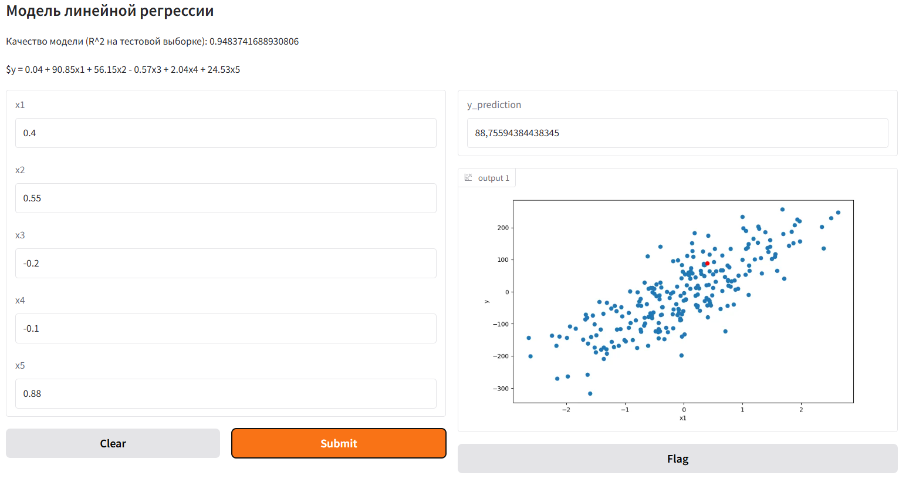

# Веб-приложение на Gradio

## Как запустить
1. Запуск витруального окружения: в терминале зайти в папку /.venv/Sqripts/ и вписать команду Activate.ps1
2. Скачивание всех зависимостей: pip install -r requirenments.txt
3. Ввод команды запуска программы: py app.py

## Пример работы программы
